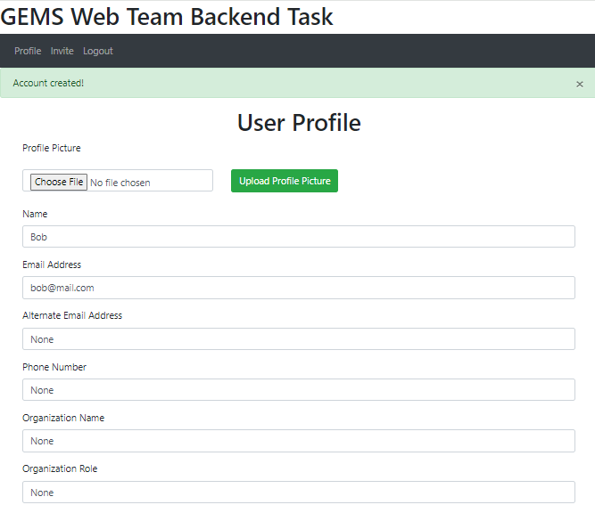

# Reference
https://www.youtube.com/watch?v=dam0GPOAvVI&t=1s
https://jsfiddle.net/KyleMit/0fscmf3L

# GEMS Web Team Backend Task using Flask

## Setup & Installation

Make sure you have the latest version of Python installed.

Clone repositry.
```bash
git clone <repo-url>
```

Install required python libraries.
```bash
pip install -r requirements.txt
```

## Running The App

```bash
python main.py
```

## Viewing The App

Go to `http://127.0.0.1:5000`


## App Guide

1. Sign up as a user in the "Sign Up" tab.
    
2. All users and invitees are able to change their profile details in the "Profile" tab.
    
3. As a user, you are able to invite anyone in the "Invite" tab. You can also delete the invite by clicking the "x" button.
    
4. As an invitee, you can only sign up using the "Invitee Sign Up" tab (you cannot login as per task instructions). You can set your password here if you have not previously set your password. If you have already set a password, use that password to sign up. Invitees are not able to invite (they have no "Invite" tab).
    
5. All users are able to logout using the "Logout" tab.
6. For debugging purposes, you can do a GET request at http://127.0.0.1:5000/user to print the JSON of all the users in the database.

## Note
I'm an E&E student, apologies if I have misunderstood the task. My web-dev skills are completely self-taught & I have a lot of coursework due haha.